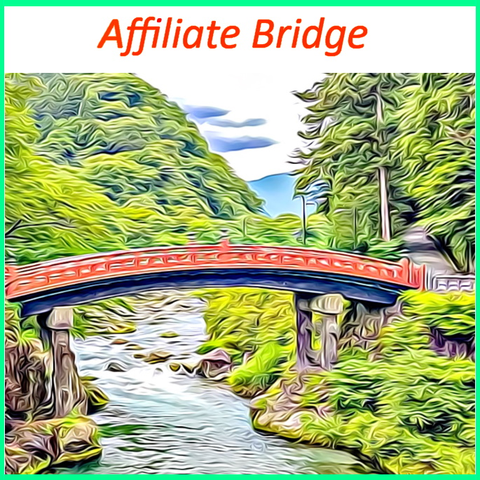
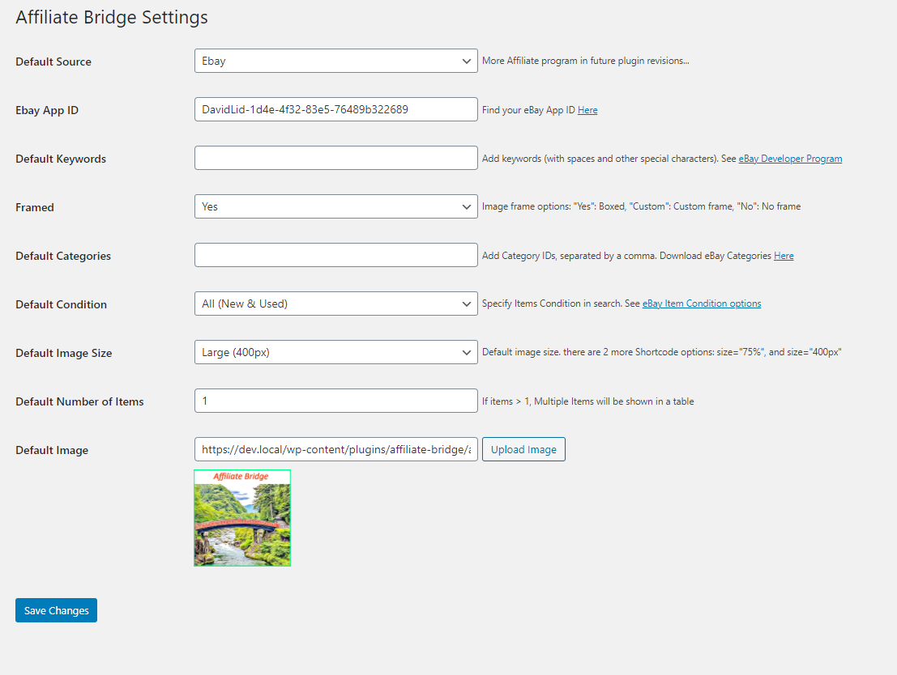
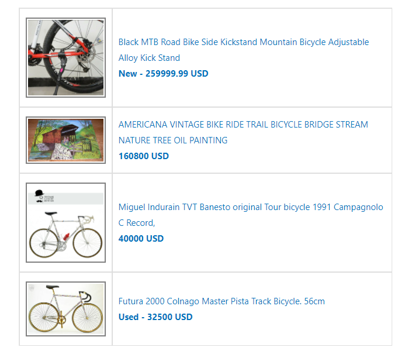

# Affiliate Bridge
> Effortlessly show affiliate items in your site.

Affiliate Bridge allows you to effortlessly integrate affiliated items (only from ebay for now) in your site.



## Installation

1. Download the plugin, unzip it and move the unzipped folder to the "wp-content/plugins" directory in your WordPress installation.
2. In your admin panel, go to Plugins and you'll find Affiliate Bridge in the plugins section.
3. Click on the 'Activate' button to use your new plugin right away.
4. PS: Remember to click the **Enable auto-updates** link for this plugin so that you don't miss cool new features as they come in.

## How to use

1. After installing and activating the Affiliate Bridge plugin in your WordPress website.
2. Navigate to the plugin settings, by pressing settings link in plugin section or navigating to it `Settings->Affiliate Bridge`
3. Set the default shortcode search attributes (i.e Keyword, category, condition, number of items etc.)
4. Set the `main affiliate` account. to see what `main affiliate` means, checkout `Our profit model`
5. Use the short code [affiliate-bridge] to show affiliated products.
6. You can use the shortcode with the default settings, or override the defaults with shortcode props.
7. Paste the code anywhere in your site
8. Save
9. Congratulations :D

## Frequently asked questions

### Q: How to use custom css filter?  
### A: Here's an example

```
add_filter('affiliate_bridge_image_style_override_custom', 'my_ridiculously_wide_border_customization');

function my_ridiculously_wide_border_customization($originalCss) {
    // you can access the original css and add to it
    $result = $originalCss . 'border:10px solid gray;';
    // what you return would be the custom css option
    return $res;
}

```

## Shortcode props

1. items - number of items to show. example: [affiliate-bridge items="4"] (default = 1)
2. size - image size. options are: `small` | `medium` | `large`. example: [affiliate-bridge size="small"] (default = large)
3. keywords - add search keywords (with spaces and other special characters). used to override the default you set in admin. example [affiliate-bridge keywords="baseball cards"]
4. framed - choose what kind of image frame to use.  example [affiliate-bridge framed="C"]. (you can also use `affiliate_bridge_image_style_override_custom` filter to use you own customized css)
5. categories - ddd Category IDs, separated by a comma. Download eBay Categories. example [affiliate-bridge keywords="baseball cards"]
6. condition - product condition. options are `All` | `New` | `Used`. example [affiliate-bridge condition="Used"] (default is `All`)
7. defimage - link to default image. example [affiliate-bridge condition="https://example.com/wp-content/uploads/08/20/my-cool-image.png"] (default is `All`)
8. source - currently no use. will be added in future versions.

## Minimum Requirements

* WordPress 5.0.0 or later
* PHP version 7.2 or later

## Screenshots

* Plugin Settings. ("assets/screenshot-1.jpg")  



* Multi Item Table Example. ("assets/screenshot-2.jpg")



## Site

https://affiliate-bridge.com/
https://www.bicycle-riding.com/

## Change log

* 1.0.0
    * Initial Release

## Our Profit Model

In its free version, Affiliate Bridge uses a "Revenue Sharing Algorithm" for splitting affiliate income between the user (the Website Owner) and the Affiliate Bridge plugin maker.
Based on the system clock, 85% of calls to the API will be made with The Website Owner's API Key.
The rest of the calls (15%), will be using a hard codded "Affiliate Bridge plugin maker"'s API key.
The Revenue Sharing Algorithm is in charge of the splitting calls STATISTICALLY to generate about 85% of Affiliate Program income to the Website Owner, the rest (about 15%) will go to the Plugin Owner.
If the Website Owner does not change the default plugin settings, Affiliate Bridge will use the plugin maker api key mentioned above 100% of the time.
Using this Revenue Sharing Model allows us to provide this product free of charge, on The Website Owner's end, while still providing a professional and reliable product.. oh, and also coffee to go with that :).

## Meta

[Our Site](https://affiliate-bridge.com/)  
[David Lidor](https://www.bicycle-riding.com/)  
  
Distributed under the GPLv2 license. See ``LICENSE`` for more information.

[https://github.com/affiliate-bridge/affiliate-bridge](https://github.com/affiliate-bridge/affiliate-bridge)